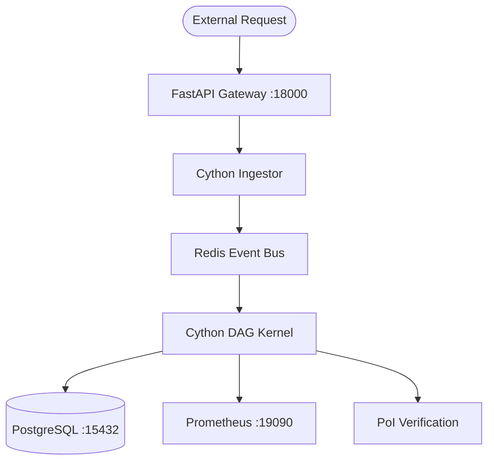

# Project OMNI: Technical Architecture 🏗️

This document outlines the high-performance design of Project OMNI and the current Cython-accelerated infrastructure.

---

## 1. System Topology

---

## 2. Core Components

### 🚀 Cython Accelerated Kernel
To achieve 200k+ TPS, OMNI bypasses the Python interpreter for serializing and validating transaction batches.
- **`data_models.pyx`**: C-struct optimizations for transaction objects.
- **`math_core.pyx`**: Parallel validation using OpenMP to verify DAG integrity across CPU cores.
- **`preprocessing/ingestor.pyx`**: Ultra-fast JSON normalization and pointer management.

### 🌊 Distributed Event Bus
Decentralized communication is handled via a Redis-backed asynchronous broker (`services/redis_broker.py`).
- **Pub/Sub Architecture**: Services subscribe to event types (e.g., `transaction.commit`) without direct coupling.
- **Reliability**: Failover to in-memory handling if Redis becomes unavailable.

### 💎 Consistent Sharding Manager
Scaling OMNI involves splitting the ledger across shards.
- **Hash Ring Implementation**: Uses consistent hashing (`services/sharding.py`) to minimize data re-distribution during node scaling.
- **Load Balancing**: Transactions are automatically routed to their responsible shard based on sender identity.

---

## 3. Production Hardening Logic

### Dependency Management
The original environment was sensitive to external library updates. We have stabilized this by:
- **Protocol Isolation**: Disabling WebSockets within the Uvicorn runtime to eliminate `websockets.legacy` conflicts.
- **Hard-Pinned Versions**: Ensuring `uvloop`, `fastapi`, and `cython` remain at verified production versions.

### Network Isolation
Each service operates on non-standard ports to ensure zero conflict in shared development environments:
- **Backend API**: 18000
- **Postgres**: 15432
- **Redis**: 16379
- **Prometheus**: 19090

---

## 4. Design Notes
Project OMNI prioritizes deterministic validation paths and predictable operational behavior.

---
*Copyright (c) 2026 Peter Nguyen.*
