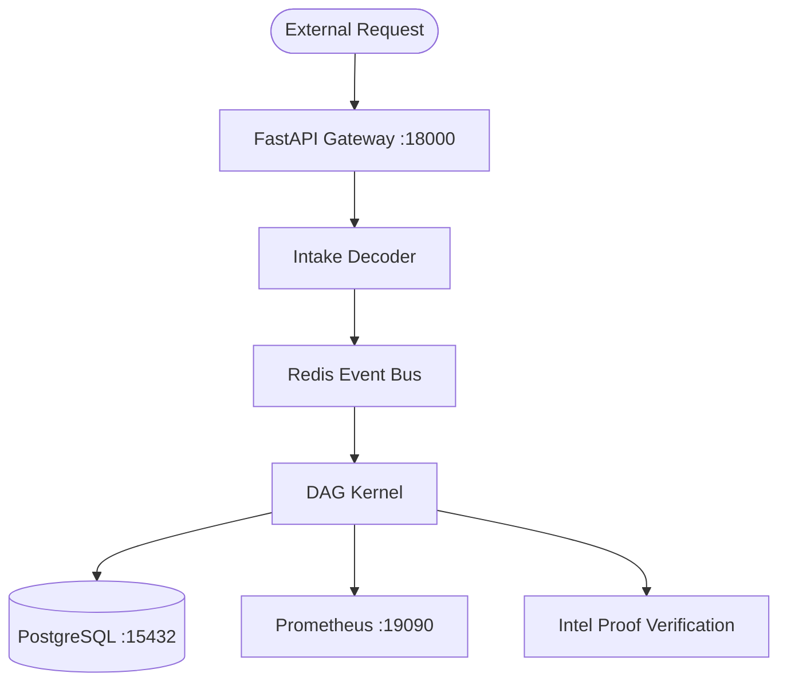

# Project Architect-OMNI-Ultimate: Technical Architecture

This document outlines the high-performance design of Project Architect-OMNI-Ultimate and the current Cython-accelerated infrastructure.

---

## 1. System Topology

---

## 2. Core Components

### Cython Accelerated Kernel

To achieve high throughput, Architect-OMNI-Ultimate uses optional Cython extensions for hot paths.

- **`aegis_types.pyx`**: Extension types for transaction objects.
- **`aegis_math.pyx`**: Parallel validation using OpenMP to verify DAG integrity across CPU cores.
- **`intake/decoder.pyx`**: Fast JSON batch decoding.

### Distributed Event Bus

Decentralized communication is handled via a Redis-backed asynchronous broker (`fabric/bus.py`).

- **Pub/Sub Architecture**: Services subscribe to event types (e.g., `transaction.commit`) without direct coupling.
- **Reliability**: Failover to in-memory handling if Redis becomes unavailable.

### Consistent Sharding Manager

Scaling Architect-OMNI-Ultimate involves splitting the ledger across shards.

- **Hash Ring Implementation**: Uses consistent hashing (`fabric/routing.py`) to minimize data re-distribution during node scaling.
- **Load Balancing**: Transactions are automatically routed to their responsible shard based on sender identity.

---

## 3. Production Hardening Logic

### Dependency Management

The original environment was sensitive to external library updates. We have stabilized this by:

- **Protocol Isolation**: Disabling WebSockets within the Uvicorn runtime to eliminate `websockets.legacy` conflicts.
- **Hard-Pinned Versions**: Ensuring `uvloop`, `fastapi`, and `cython` remain at verified production versions.

### Network Isolation

Each service operates on non-standard ports to ensure zero conflict in shared development environments:

- **API Gateway**: 18000
- **Postgres**: 15432
- **Redis**: 16379
- **Prometheus**: 19090

---

## 4. Design Notes

Project Architect-OMNI-Ultimate prioritizes deterministic validation paths and predictable operational behavior.

---

_Copyright (c) 2026 Peter Nguyen._
