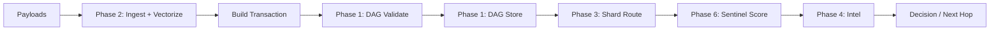
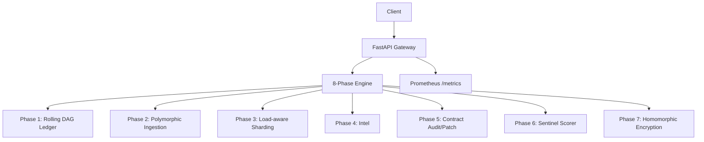
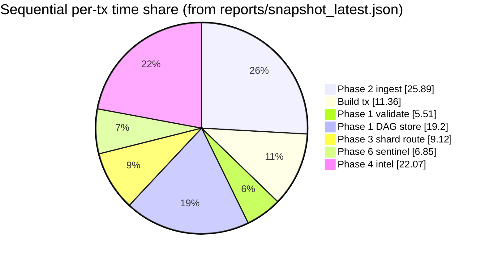

# Project Architect-OMNI-Ultimate

High-performance, modular pipeline implementing 8 phases:

1. Phase 1: DAG ledger (rolling/bounded-memory)
2. Phase 2: Polymorphic ingestion + vectorization
3. Phase 3: Consistent sharding (load-aware)
4. Phase 4: Intel proof engine
5. Phase 5: Self-healing contract audit/patch
6. Phase 6: Sentinel risk scoring
7. Phase 7: Homomorphic encryption (Paillier via `phe`)
8. Phase 8: API gateway route coverage checks

All metrics below are generated from the local scripts and saved under `reports/`.

## Quickstart

### Local (Windows-friendly)

```bash
python -m venv .venv
.venv\Scripts\activate
pip install -r requirements.txt
uvicorn aegis_app:app --host 0.0.0.0 --port 18000
```

- Swagger UI: `http://localhost:18000/docs`
- Health: `http://localhost:18000/health`
- Metrics: `http://localhost:18000/metrics`

### Docker (optional)

```bash
docker-compose up --build
```

## API (Phase Endpoints)

All phase endpoints are under `/api/v1`:

- Phase 1 DAG: `POST /phase1/dag/submit`, `GET /phase1/dag/tips`
- Phase 2 ingest: `POST /phase2/ingest`
- Phase 3 shard route: `POST /phase3/shard/route`
- Phase 4 intel: `POST /phase4/intel/prove`, `POST /phase4/intel/verify`
- Phase 5 covenant: `POST /phase5/covenant/audit`
- Phase 6 sentinel: `POST /phase6/sentinel/score`
- Phase 7 HE: `POST /phase7/he/keygen`, `POST /phase7/he/encrypt`, `POST /phase7/he/decrypt`, `POST /phase7/he/add`

Compatibility endpoints preserved:

- `POST /api/v1/ingest`
- `POST /api/v1/validate`

## Latest Results (from reports/)

Source of truth:

- `reports/bench_latest.json`
- `reports/accuracy_latest.json`
- `reports/snapshot_latest.json`

### Benchmark (N=20,000)

Per-stage throughput (single-process microbench):

| Stage                        |        TPS |
| ---------------------------- | ---------: |
| Phase 2 ingest               |  64,880.80 |
| Build tx object              | 147,856.82 |
| Phase 1 validate             | 304,802.78 |
| Phase 1 DAG store            |  87,458.92 |
| Phase 3 shard route          | 184,214.48 |
| Phase 6 sentinel score       | 245,354.22 |
| Phase 4 intel (M=5,000)      |  76,093.54 |

Non-per-tx microbenches:

- Phase 5 audit (cached, 2,000 runs): 0.004829s total
- Phase 5 audit (uncached, 500 runs): 0.0219365s total
- Phase 7 HE (50 ops): 2.6114999s total

### Sequential Estimate for 123,456,789 Transactions

Sequential model (single worker, phases executed one-after-another):

- Total per-tx cost: $5.9536845\times 10^{-5}$ seconds (≈ 59.54 μs)
- Estimated throughput: 16,796.32 tx/s
- Estimated wall-clock time: 2:02:30

Time-share breakdown (sequential per-tx):

| Stage               |  Share | Cost (μs/op) |
| ------------------- | -----: | -----------: |
| Phase 2 ingest      | 25.89% |        15.41 |
| Build tx object     | 11.36% |         6.76 |
| Phase 1 validate    |  5.51% |         3.28 |
| Phase 1 DAG store   | 19.20% |        11.43 |
| Phase 3 shard route |  9.12% |         5.43 |
| Phase 6 sentinel score |  6.85% |         4.08 |
| Phase 4 intel         | 22.07% |        13.14 |

Notes:

- This estimate is a single-worker sequential model; parallel workers can reduce wall-clock time until shared bottlenecks dominate.
- Phase 4 intel is measured over `intel_M=5000` proofs (not `N=20000` transactions); per-op cost uses `sec/intel_M`.

### Accuracy (8 Phases)

From `reports/accuracy_latest.json`:

| Phase   | Metric                   |           Value |
| ------- | ------------------------ | --------------: |
| Phase 1 | accept_accuracy          |            1.00 |
| Phase 1 | missing_parent_reject    |            1.00 |
| Phase 2 | field_accuracy           |            1.00 |
| Phase 2 | reject_accuracy          |            1.00 |
| Phase 3 | consistency_accuracy     |            1.00 |
| Phase 3 | load_aware_flip_rate     |            0.93 |
| Phase 4 | accuracy                 |            1.00 |
| Phase 5 | accuracy / F1            |     1.00 / 1.00 |
| Phase 6 | accuracy / F1            | 0.9067 / 0.8372 |
| Phase 7 | correct                  |            1.00 |
| Phase 8 | route_existence_accuracy |            1.00 |

Note: Phase 6 metrics are on synthetic labeled data; real accuracy requires real labels.

## Graphs

### Phase Pipeline



### Architecture (Logical)



### Sequential Time Share



## Reproducing the Reports

```bash
python ops/bench_8phases.py
python ops/accuracy_report.py
python ops/snapshot_report.py
```

## License

Copyright (c) 2026 Peter Nguyen.

Non-commercial license: learning/study/modification allowed; commercial use prohibited unless you obtain a separate commercial license.
See `LICENSE` for full terms.
